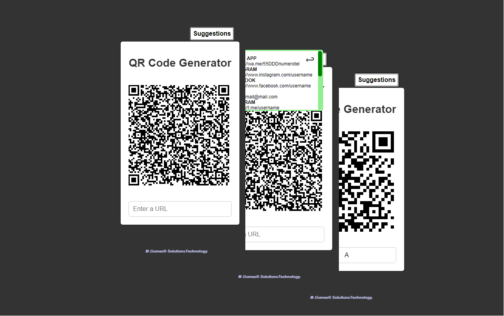

<h1 align="center"> Gerador de QR Code </h1>

    Trata-se de um projeto destinado a gerar códigos QR através de uma bibilioteca javascript. 
    Para utilização de fins diversos, como apontamento de links para rede sociais e web sites.

  <a href="#-tecnologias">Tecnologias</a>&nbsp;&nbsp;&nbsp;|&nbsp;&nbsp;&nbsp;
  <a href="#-projeto">Projeto</a>&nbsp;&nbsp;&nbsp;|&nbsp;&nbsp;&nbsp;
  <a href="#-layout">Layout</a>&nbsp;&nbsp;&nbsp;|&nbsp;&nbsp;&nbsp;
  <a href="#memo-licença">Licença</a>

  

 

  

## 🚀 Tecnologias

Esse projeto foi desenvolvido com as seguintes tecnologias:

- HTML e CSS
- JavaScript
- Git e Github
- Biblioteca JS

## 💻 Projeto

    A aplicação destina-se a criar códigos QR de acordo com endereços fornecidos pelo usuário. 
    Utilizando de biblioteca javascrit, a aplicação gera formas de QR com o intuito de que essas possam ser editadas atraves do aplicativo de imagens presentes nos smartphones, colocando algum título, ou simplesmente cortadas, podendo ser utilizadas em impressões ou simples divulgações pelas rede sociais.

[Visite a documentação](https://cdnjs.com/libraries/qrcodejs)

[Visite o projeto online](https://celo-gomes.github.io/meuqrcode)

## 🔖 Layout

O Layout do projeto toma como sugestão outras páginas online sobre o assunto, colocando algumas funcionalidades extras, usando de simplicidade, visando a mecânica e utilização. 

## :memo: Considerações

Esse projeto está sob a licença MIT. 

---

Feito com ♥ by M. Gomes :wave: [Visite no Github](https://github.com/celo-gomes)
